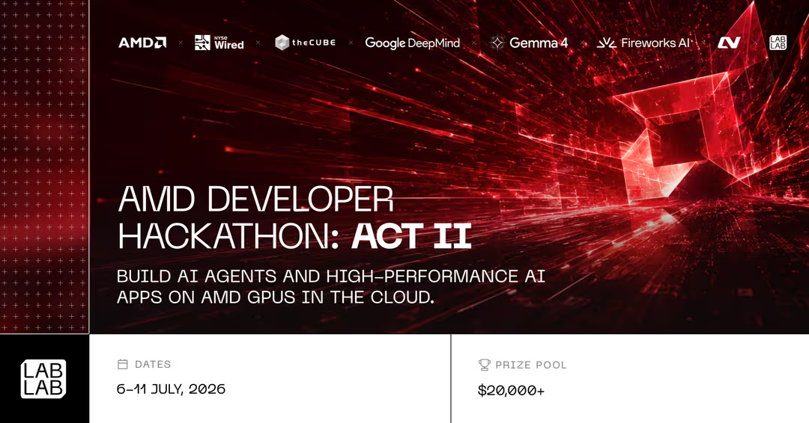

<h1 align="center">
  
</h1>

<h3 align="center">💾 AByT3s — <i>a byte(s), one small unit grinding through Earth Online (地球online)</i> 💾</h3>

<p align="center">
  
</p>

<p align="center">
  <a href="https://www.linkedin.com/in/phang-lehenn-76aa4b289/"></a>
  <a href="mailto:alvinhenn002@gmail.com"></a>
  <a href="https://alvinhenn.github.io/Portfolio/"></a>
  <a href="https://github.com/AlvinHenn"></a>
  <a href="https://lablab.ai"></a>
</p>

---

### `> whoami`

```yaml
name: Phang Lehenn (Alvin)
alias: AByT3s
role: Computer Science Graduate (BSc Hons, 2:1) — Heriot-Watt University
focus: Full-stack development · Mobile apps · AI/NLP systems
status: Seeking a graduate Software Engineering role
philosophy: "Every byte counts — building one commit at a time."
```

---

### 🧬 `Tech Stack`

<p align="center">
  
</p>

<div align="center">

| Layer | Tools |
|---|---|
| **Languages** | Java · JavaScript · Python · C/C++ · Kotlin · Swift |
| **Frontend** | ReactJS · Flutter · TypeScript · Tailwind CSS · HTML/CSS |
| **Backend** | Spring Boot · FastAPI · REST API |
| **Data** | MySQL · PostgreSQL · NoSQL · NeonDB · Prisma |
| **AI / ML** | Scikit-learn · TensorFlow · PyTorch · Keras · NLP · RAG · LangGraph |
| **Workflow** | Agile · Scrum · CI/CD · Git · Jira |
| **AI Assistants** | Claude · Gemini · ChatGPT · Codex |

</div>

---

### ⚡ `Featured Builds`

```
[ 01 ] MarketScout AI — Multi-Agent Market Intelligence Platform (2026)
        → Built for the AMD Developer Hackathon: ACT II (Unicorn Track) — a
          12-agent platform that turns a startup idea into a full market report
          (competitors, patents, funding, market trends, SWOT) in minutes.
        → My role: frontend development, connecting the dashboard to backend
          APIs, and troubleshooting UI/data-flow across the agent pipeline.
        → Next.js · Tailwind CSS · AMD Developer Cloud · Fireworks AI · LangChain
        → 🔗 See submission in "Hackathons Participated" below

[ 02 ] ExpenseLab — Personal Finance Tracker (2026)
        → Full-stack finance app with auth, dashboards, and analytics.
        → TypeScript · Neon PostgreSQL

[ 03 ] Twitter Sentiment Analysis & Stock Market Research (2025-2026)
        → NLP pipeline (FinBERT + SentiStrength) correlating social sentiment
          with stock price movement.
        → Python · NLP · Data Analysis

[ 04 ] NZHome — Smart Home Energy Awareness App (2025)
        → Full-stack team project (7 devs) tracking energy consumption.
        → React · Spring · Spring Security · Vercel · Railway
```

📁 More on my [Portfolio](https://alvinhenn.github.io/Portfolio/) →

---

### 🏆 `Hackathons Participated`

<p float="left">
  <a href="https://lablab.ai/ai-hackathons/amd-developer-hackathon-act-ii/hack-horizon/marketscout-ai" target="_blank">
    
  </a>
</p>

<div align="center">

**MarketScout AI** — Team **Hack-Horizon** · lablab.ai × AMD × Fireworks AI

Built a 12-agent platform that turns a startup idea into a full market
validation report (competitors, patents, funding, trends, SWOT) in minutes,
running on AMD Instinct GPUs via Fireworks AI. **My contribution: frontend
development** — building the dashboard and wiring it to the backend agent
pipeline.

[🔗 Submission](https://lablab.ai/ai-hackathons/amd-developer-hackathon-act-ii/hack-horizon/marketscout-ai) · [💻 GitHub](https://github.com/abdullahxyz85/MarketScout-AI) · [🎥 Demo](https://ai.itdpy.xyz/)

</div>

---

### 📊 `GitHub Stats`

<p align="center">
  
  
</p>

<p align="center">
  
</p>

<p align="center">
  
</p>

---

<p align="center">
  
</p>

<p align="center"><i>01000001 01000010 01011001 01010100 00110011 01110011 — decoding one commit at a time.</i></p>
